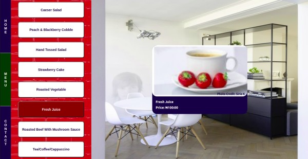

# Restaurant Page

> A sample page for a restaurant, built with javascript and minimal HTML. The goal is to use as little of HTML as possible. Javascript is used to add and remove the appropriate elements from the DOM as user interacts with the page.




## Built With

- JavaScript
- HTML
- SCSS
- Webpack

## Live Demo

[Github Pages](https://chasscepts.github.io/restaurant-page/)

## Getting Started

To get a local copy up and running follow these simple example steps on the command line.

```bash

  # Clone the project from it's github repo.

  $ git clone https://github.com/chasscepts/restaurant-page

  # Change directory to the root of project

  $ cd restaurant-page

  # Install all dependencies

  $ npm install

  # Start webpack-dev-server (This will open the page in your browser and automatically refresh it when you make changes)

  $ npm run serve

  # To build the project for production

  $ npm run build

```

## Authors

👤 **Obetta Francis**

[](https://github.com/chasscepts) [](https://twitter.com/chasscepts) [](https://www.linkedin.com/in/chasscepts/)

## 🤝 Contributing

Contributions, issues, and feature requests are welcome!

Feel free to check the [issues page](https://github.com/chasscepts/restaurant-page/issues).

## Show your support

Give a ⭐️ if you like this project!

## Acknowledgments

- Background Image By [Jean-Philippe Delberghe](https://unsplash.com/@jipy32?utm_source=unsplash&utm_medium=referral&utm_content=creditCopyText) on [Unsplash](https://unsplash.com/s/photos/interior?utm_source=unsplash&utm_medium=referral&utm_content=creditCopyText)
- Home page dish image By [Irene Kredenets](https://unsplash.com/@ikredenets?utm_source=unsplash&utm_medium=referral&utm_content=creditCopyText) on [Unsplash](https://unsplash.com/s/photos/dish?utm_source=unsplash&utm_medium=referral&utm_content=creditCopyText)
- Menu Posters By [Sirle K](https://www.postermywall.com/index.php/d/sirle-kabanen)
- Circular Text By [Geoff Graham](https://css-tricks.com/snippets/svg/curved-text-along-path/)
- Aspect Ratio By [Nathan Ryan](https://stackoverflow.com/a/6615994)
- Microverse Community
- Everyone whose code was used in this project

## 📝 License

This project is [MIT](./LICENSE)
